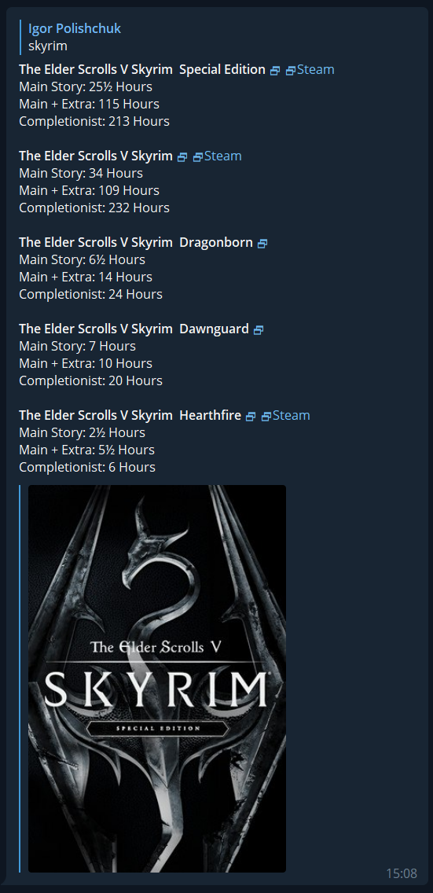

# How Long To Beat Telegram Bot

Telegram bot (hosted by AWS Lambda) that respond with [How Long To Beat](https://howlongtobeat.com/) information by scrapping site itself.

[@htlb_assistant_bot](https://t.me/hltb_assistant_bot)

Here how typical response would look like: 



## Build

### Using Docker

1. Prerequisite: Docker
2. Run the build script
```
   ./build.sh
```
   This build is pinned to `linux/amd64` in `docker-compose.yaml` so it can produce `x86_64-unknown-linux-musl` Lambda binaries from Apple Silicon hosts.

3. The Lambda deployment artifact will be written to `./dist/rust_hltb_bot.zip`.

4. (Optional) Build for a different Lambda architecture by overriding `TARGET_TRIPLE` in `docker-compose.yaml` and `docker/build.sh`.

### Locally
1. Prerequisite: Linux
2. Install Rust https://www.rust-lang.org/tools/install
3. Install musl toolchain
   ```
   rustup target add x86_64-unknown-linux-musl
   ```
4. Install musl-tools
   ```
   sudo apt install musl-tools 
   ``` 
5. Install zip
   ```
   apt-get install zip
   ```
6. Install build essential
   ```
   apt-get install -y build-essential
   ```
7. Build
   ```
   TARGET_TRIPLE=x86_64-unknown-linux-musl bash ./docker/build.sh
   ```

The Lambda deployment artifact will be written to `./dist/rust_hltb_bot.zip`.

## Deploy

Prerequisite: configured AWS CLI credentials with permission to update the target Lambda function.

Deploy the latest local artifact directly to Lambda:

```
./deploy.sh <lambda-function-name>
```

The first successful run stores the function name in `./.lambda_function_name`, so later runs can simply use:

```
./deploy.sh
```

You can also provide the function name via `FUNCTION_NAME`:

```
FUNCTION_NAME=<lambda-function-name> ./deploy.sh
```

You can also provide the function name via environment variable:

```
LAMBDA_FUNCTION_NAME=<lambda-function-name> ./deploy.sh
```

If your artifact is stored somewhere else, override `ARTIFACT_PATH` when running `deploy.sh`.
If you want to store the remembered function name somewhere else, override `FUNCTION_NAME_FILE`.

## Run

Define env variables:
- `API_KEY` - bot token
- `RUN_MODE` - "Polling" or "WebHook" (case-insensitive). Defaults to "WebHook"
- `LOG_LEVEL` - https://docs.rs/log/latest/log/enum.LevelFilter.html#variants
- `ENTRIES_LIMIT` - how many entries to show (max). Defaults to 5
- `HLTB_DOMAIN_URL` - HLTB site URL. Defaults to `https://howlongtobeat.com`
- `HLTB_INIT_URL` - HLTB search bootstrap endpoint. Defaults to `https://howlongtobeat.com/api/search/site/init`
- `HLTB_FIND_URL` - HLTB search endpoint. Defaults to `https://howlongtobeat.com/api/search/site`

Bot can function both in long-polling and webhooks mechanism.
To register it to use in  WebHook mode, you can call lambda with following JSON:
```json
{
  "lambda_rq_type": "register_webhook",
  "url": "<webhook url>"
}
```
or following to unregister:
```json
{
  "lambda_rq_type": "remove_webhook"
}
```

Any other JSON would be interpreted as Telegram WebHook message.


## License

MIT